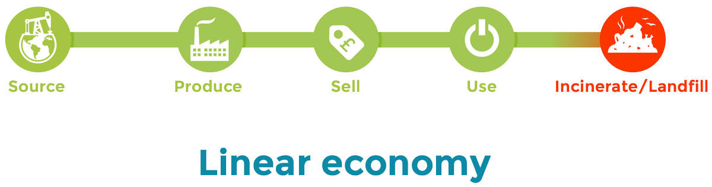
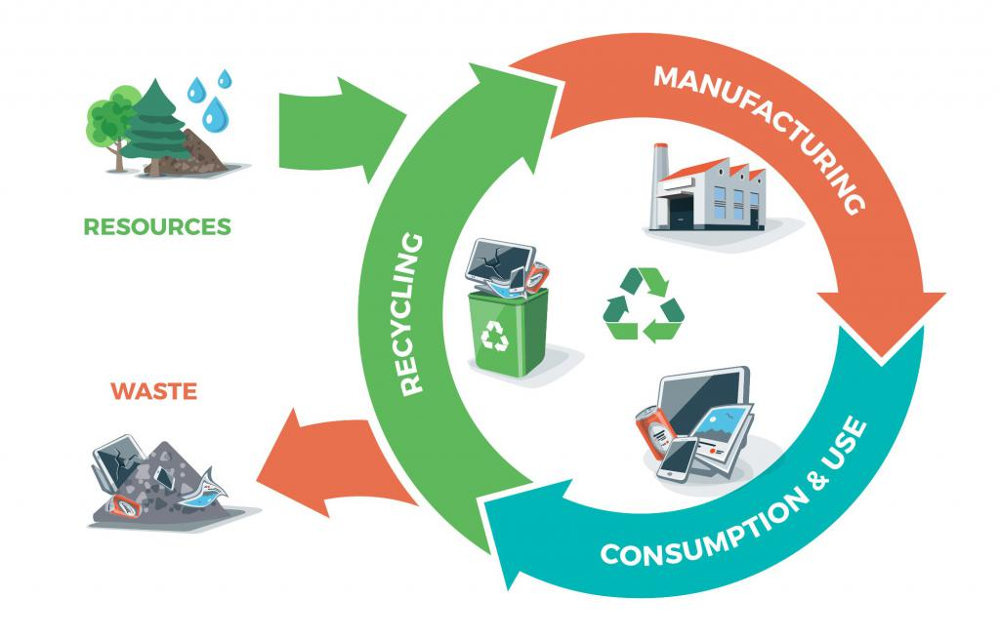
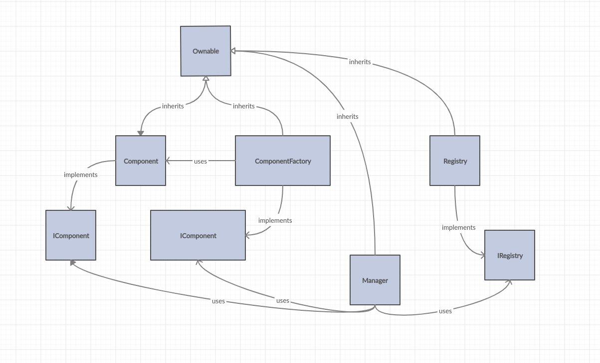
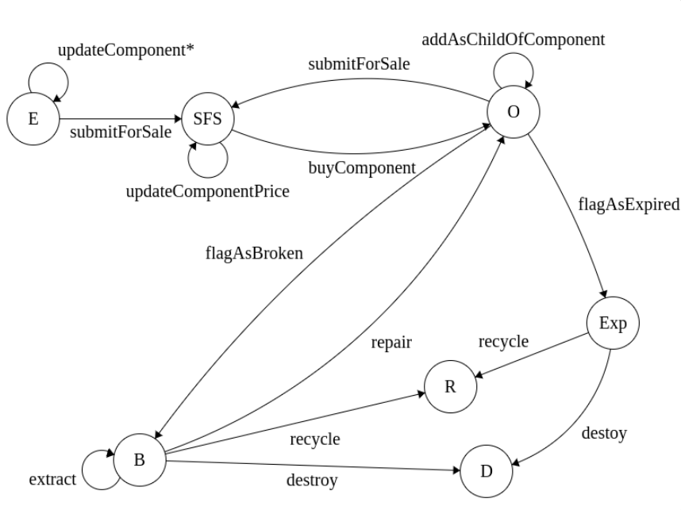

# Circular economy on top of the Blockchain


## What motivates this project?

In this project I try to implement something that would be against the **linear economy model** which describes itself as: **Take** -> **Make** -> **Dispose**.



Image was taken from [here](https://circulartayside.co.uk/what-is-the-circular-economy/).

This model (``liniar``) as we can clearly see is not long term sustainable and comes with a lot 
of problems and disadvantages such as waste and emission leakage which results later in pollution. 
Further more in the case of **linear** model we have problems with the system because of the agents that are not being honest on how the resources are being managed.

The **circular economy model** focuses on **recycling**. It proves himself more sustainable then the **linear model** by reusing the raw material that was initially used in the creation of other products.



This image was taken from [here](https://ec.europa.eu/jrc/en/news/research-helps-europe-advance-towards-circular-economy) and it pretty much illustrates the circular model.


## Problems with the linear model and how does blockchain fit into the mix, in order to solve this problem?

One can not solve the problem by centralizing the ``circular model`` in my opinion, because of problems such as **corruption** and **lack of transparency**. 

That is why the new system has the following qualities **incorruptible**, **fully transparent** and to **benefit all actors**. This system will also solve problems such as ownership, and will benefit all the honest actors using it.

And as we all know [ownership](https://www.economist.com/briefing/2015/10/31/the-great-chain-of-being-sure-about-things), corruption, lack of transparency and pollution are the biggest problems that we face in the 21st century. 

Thanks to the **Blockchain technology** I will be able to develop a system that will create a solution to those problems. 

## Objective

The system has to make sure that every actor that is interacting with the components:

- Has the right to do so
- Is NOT malicious 
- Benefits himself and the others by using this system
- Provide immutable data => digital trails
- enable manufacturers, recyclers, all the way to consumers to confidently assert the circularity of their products

## Description

All products that are tracked by the system will be divided into **components** and every component
will be composed by other components. 


## Contracts




### Component 

Each component is gonna be separated into his own smart contract. This contract is gonna be responsible of storing all the events corresponding to the component, fields and methods that would allow
for better state management of the component.

Fields that a component should have: 

|           Name           | Type           | Description                                                  |
| :----------------------: | -------------- | ------------------------------------------------------------ |
|          owner           | address        | Is gonna keep the information about the current owner of the component |
|        entityName        | string/bytes32 | The name of the current entity                               |
|       creationTime       | uint64         | The time at which the component was created / added to the Blockchain |
|        expiration        | uint64         | Time when the component should be taken out of the market/recycled |
|          price           | uint128        | Price of the corresponding component                         |
|          state           | EntityState    | Represents the state, this component is in.                  |
|  parentComponentAddress  | address        | Address of the component containing this component. Should be ``address(0)`` if the component doesn't exist |
|     otherInformation     | string         | Other information related to the component                   |
| childComponentsAddresses | address[]      | Addresses of the child components                            |


The **state** field is gonna be one of the must important fields of a component, because it allows and restricts which actors have access to the components.



**States**:

------------

- **(E) Editable** = An entity will be in Editable state only at the beginning

  And as long as the component is in this state, the manufacturer can change some of it's properties.

- **(SFS) SubmitedForSale** = When a component is ``SubmitedForSale`` we can no longer change properties of that component (except for the ``price``). After is being bought it goes into ``Owned`` state.

- **(O) Owned** =  Simply means that a ``Component`` is being used by a user who owns it.  Where being used means the owner can do the following things: 

  - Replace some of the component children
  - Remove parts of it
  - Sell it

- **(B) Broken** = A ``Component`` gets into Broken state if one of the components has been removed without being replaced.  It also stays in broken state if we remove more from it.

- **(Exp) Expired** = A ``Component`` that is into Expired state need to immediately be recycled or destroyed.

  

**Events** the ``ComponentContract`` will emit:

--------------------------------------------------------------

- **ComponentCreated** &rarr; emitted when we create a component

- **ComponentUpdated** &rarr; emitted when we change the value of one field. Musty when we call the following methods: 
  - updateComponentName
  - updateComponentExpiration
  - updateComponentPrice
  - updateOtherInformation
  - addToOtherComponent
  - removeComponentFromOtherComponent
  - flagAsBroken
  - flagAsExpired
  - replaceComponent

  ### custom events vs general event

  

- **ComponentSubmitedForSale** &rarr; emitted when a component is submitted for sale.

- **ComponentWasBought** &rarr; emitted when someone else bought the component

- **ComponentRemovedFromMarket** &rarr; emitted when a component was removed by the owner from the market

- **OwnershipTransferred**  &rarr; emitted when a component is bought.


### IComponent

This contract will define a interface that the  ``Manager``  contract will use in order to interact with the ``components`` .


IComponent standard interface: 

```solidity
pragma solidity >=0.4 <0.6.0; 

interface IComponent{
	// Will be defined as I dive deeper into the project
}

```


### ComponentFactory

Contract responsible of creating(deploying) other components on the blockchain.

```solidity
pragma solidity >=0.4.22 <0.6.0;

import "./Component.sol";

contract ComponentFactory {

    function createComponent(string calldata _listOfComponentInfo, address _owner) external returns (address){
        Component c = new Component(_listOfComponentInfo, _owner);
        return address(c);
    }
}

```


<span style="color:red">Open discussion: Should people be able to deploy components on their own without using the ComponentFactory and then... later on add them using some method inside the manager contract?</span>

A: only manager can do that.

- CompFac as library?
- Inside manager
-  


### IComponentFactory interface

This contract will define a interface that the  ``Manager``  contract will use in order to interact with the ``ComponentFactory`` .


### Registry

Contract that stores the addresses of the deployed contracts on the Blockchain.

Used mainly in order to retrieve the address of all deployed components. Should also take care of the components that have been ``SubmitedForSale`` in another list. 

**Events** emitted by the **Registry** contract:

- **NewComponentRegistred** &rarr; emitted when we register a new component that was deployed.
- ? **ComponentRemoved** &rarr; emitted when we remove a component, usually happens if we recycle/destroy the component. &rarr; flag


### IRegistry interface

Contract that acts like a proxy in order to interact with the registry contract.

```
pragma solidity >=0.4 <0.6.0; 

interface IRegistry {
    function addComponent(address _componentAddress) external;
    function removeComponent(uint256 _index) external;
    function getRegistrySize() external view returns(uint256);
    function getRegistredComponentAtIndex(uint256 _index) external view returns(address);
    function getRegistredComponents() external view returns(address[] memory);
    function owner() external view returns (address);
    function transferOwnership(address newOwner) external;
    
    // might need 2 more functions responsible for storing submitedForSale components and 
    // removal of those components
}

```


## Market

- TBD
- Lock component till reaches block number for multiple users (auction base)


### Manager


Contract that allows user to perform operations inside the system and also orchestrates the 
other contracts. 

Manager takes care of the following:

- registering components to the **Registry**.
- orchestrates all ``system contracts``
- trust-less transfers of components and tokens when a component is bought/sold.
- ensures that each actor on the system is rewarded/punished for his behavior.
- ? the only way  change the state of a component would be by using the **Manager** contract


<span style="color:red"> Open dicussion: Should the manager be the only component allowed to do changes on other components?</span>


A: Only manager has access.


## Actors

The system will have 3 actors in the beginning: 

- Manufacturer 

- Consumer/Owner

- Recycler /**Repairer**

  


### Manufacturerz

The person which is gonna be responsible of turning the raw material that he has to a product (in this case a component). 

In order for a user to become a manufacturer he would have to register for this.

Things he can do: 

- Create new components.
- Allowed to edit everything about them before submitting it for sale. After that he can no longer touch them.
- Buy recycled raw material from the Recycler.

### Consumer/Owner

The Consumer/Owner will consume/own the **Component** and he has the following rights:

- Buys Components.
- Sells Components.
- Update the price of the Components.
- Flag his or other components as broken


### Recycler

The Recycler takes the components that expired or were flanged as ``broken`` and recycles them. He will be rewarded for doing this. He can perform the following actions:

- Flag component as broken
- Recycle component
- Sell raw material


## The system should reward actors who: 

- Flag Components for being ``Expired`` and 
- Recycle Components
